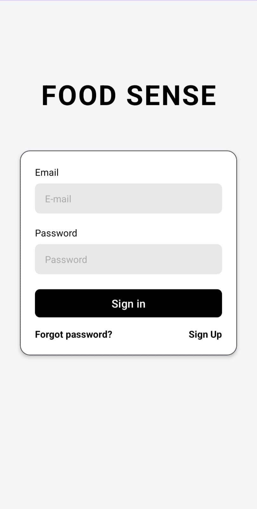
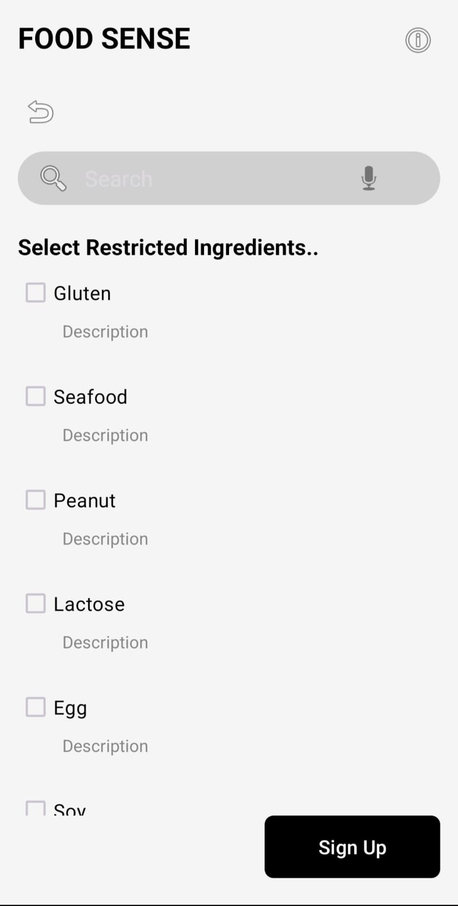
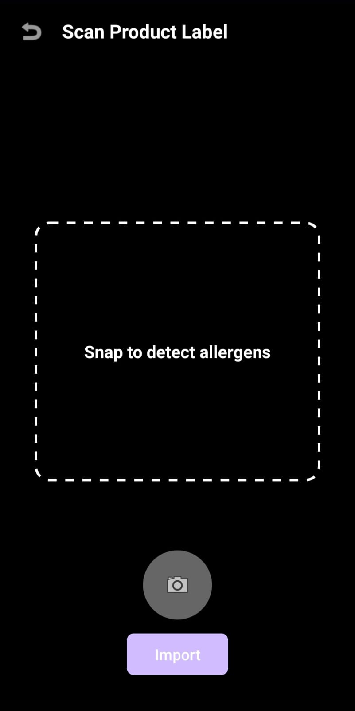

# 🍎 FoodSense - Personalized Allergen Detection App

[](https://www.android.com/)
[](https://android-arsenal.com/api?level=24)
[](https://www.java.com/)
[](LICENSE)

FoodSense is an Android application that helps users with food allergies and dietary restrictions quickly scan product labels to check if they're safe to consume. Using OCR technology and personalized allergen lists, it provides instant feedback on product safety.

---

## 📱 Screenshots

| Login Screen | Allergen Selection | Scan Screen | Result Screen |
|:------------:|:------------------:|:-----------:|:-------------:|
|  |  |  |  |

---

## ✨ Features

- 🔐 **User Authentication** - Secure login and registration system
- 🥜 **Personalized Allergen List** - Select up to 8 dietary restrictions
- 📷 **Camera Scanning** - Real-time product label scanning
- 🔍 **OCR Technology** - Automatic text extraction from images
- 🌍 **Multi-language Support** - Turkish and English ingredient detection
- 📴 **Offline Mode** - Works completely offline, no internet required
- 👤 **Profile Management** - Update personal info and allergen preferences
- ⚡ **Instant Results** - Get Safe/Unsafe verdict in 2 seconds

---

## 🏗️ Architecture

FoodSense follows modern Android development best practices:
```
┌─────────────────────────────────────┐
│      Presentation Layer             │
│  (Fragments + ViewBinding)          │
└─────────────────────────────────────┘
              ↕
┌─────────────────────────────────────┐
│      Business Logic Layer           │
│  (Validation + Matching Algorithm)  │
└─────────────────────────────────────┘
              ↕
┌─────────────────────────────────────┐
│         Data Layer                  │
│  (Room Database + SharedPreferences)│
└─────────────────────────────────────┘
```

### Architecture Highlights:
- **Single Activity Architecture** - One MainActivity hosting 8 Fragments
- **Room Database** - Local data persistence with compile-time SQL verification
- **Navigation Component** - Type-safe fragment navigation
- **ViewBinding** - Null-safe view access
- **Background Threading** - Executors for database operations

---

## 🛠️ Tech Stack

### Core Technologies
| Technology | Purpose | Version |
|-----------|---------|---------|
| **Java** | Programming Language | 8 |
| **Android SDK** | Platform | API 24+ |
| **Room** | Database ORM | 2.5.2 |
| **CameraX** | Camera Operations | 1.4.1 |
| **ML Kit** | OCR Text Recognition | 16.0.1 |
| **Navigation Component** | Fragment Navigation | 2.8.5 |

### Android Jetpack Components
- **Room** - Type-safe database access
- **ViewBinding** - View binding without findViewById
- **Navigation** - Fragment navigation with visual graph
- **Lifecycle** - Lifecycle-aware components

### External Libraries
- **Google ML Kit Text Recognition** - On-device OCR
- **CameraX** - Modern camera API
- **Material Design Components** - UI components

---

## 📦 Project Structure
```
app/src/main/java/msku/ceng/madlab/foodsense/
│
├── 📁 database/
│   ├── AppDatabase.java          # Room Database singleton
│   └── UserDao.java               # Data Access Object
│
├── 📁 models/
│   └── User.java                  # User entity
│
├── 📁 ui/
│   ├── 📁 auth/
│   │   ├── LoginFragment.java
│   │   ├── SignUpFragment.java
│   │   ├── AllergenSelectionFragment.java
│   │   └── IngredientInfoFragment.java
│   │
│   ├── 📁 home/
│   │   ├── HomeFragment.java
│   │   ├── ProfileFragment.java
│   │   └── UpdateAllergensFragment.java
│   │
│   └── 📁 scan/
│       ├── ScanFragment.java
│       └── ResultFragment.java
│
└── MainActivity.java              # Single Activity host
```

---

## 🚀 Getting Started

### Prerequisites
- Android Studio Arctic Fox or later
- JDK 8 or later
- Android SDK API 24 or higher
- Gradle 8.2.0 or later

### Installation

1. **Clone the repository**
```bash
   git clone https://github.com/ebrudeniz/foodsense.git
   cd foodsense
```

2. **Open in Android Studio**
   - Open Android Studio
   - Select "Open an Existing Project"
   - Navigate to the cloned directory
   - Click "OK"

3. **Sync Gradle**
   - Wait for Gradle sync to complete
   - If prompted, accept any SDK updates

4. **Run the app**
   - Connect an Android device or start an emulator
   - Click "Run" (Shift + F10)


---

## 🎯 How to Use

### 1️⃣ **Registration**
- Enter personal information (name, email, password, birth date, gender)
- Select allergens you want to avoid (Gluten, Lactose, Egg, etc.)
- Complete registration

### 2️⃣ **Login**
- Use your email and password
- Stay logged in automatically

### 3️⃣ **Scan Products**
- Navigate to Scan screen
- Point camera at product ingredient list
- Tap Capture button
- Wait 2 seconds for OCR processing

### 4️⃣ **View Results**
- **Green Card** - Product is safe ✅
- **Red Card** - Product contains allergens ⚠️
  - Lists which allergens were found

### 5️⃣ **Update Profile**
- Edit personal information
- Add/remove allergens
- Changes save immediately

---

## 🔬 Technical Implementation

### Database Schema
```sql
CREATE TABLE users (
    id INTEGER PRIMARY KEY AUTOINCREMENT,
    name TEXT NOT NULL,
    surname TEXT NOT NULL,
    email TEXT NOT NULL UNIQUE,
    password TEXT NOT NULL,
    birthDate TEXT,
    gender TEXT,
    restrictedIngredients TEXT
);
```

### Background Threading Pattern
```java
// All database operations use background threads
Executors.newSingleThreadExecutor().execute(() -> {
    // Background thread: Database operation
    User user = database.userDao().login(email, password);
    
    // Main thread: UI update
    requireActivity().runOnUiThread(() -> {
        // Update UI safely
        Toast.makeText(context, "Login successful").show();
    });
});
```

### OCR Processing Flow
```
1. Capture Image (CameraX)
        ↓
2. Convert to InputImage
        ↓
3. ML Kit Text Recognition
        ↓
4. Extract Text Blocks
        ↓
5. Allergen Matching Algorithm
        ↓
6. Display Result (Safe/Unsafe)
```

### Allergen Matching Algorithm
```java
// Supports both Turkish and English
// Handles OCR character errors
private boolean checkAllergenInText(String text, String allergen) {
    switch (allergen) {
        case "lactose":
            return text.contains("milk") || text.contains("dairy") ||
                   text.contains("süt") || text.contains("laktoz");
        case "gluten":
            return text.contains("wheat") || text.contains("gluten") ||
                   text.contains("buğday") || text.contains("un");
        // ... more allergens
    }
}
```

---

## 🧪 Testing

### Running Tests
```bash
# Unit Tests (JVM)
./gradlew test

# Instrumented Tests (Device/Emulator required)
./gradlew connectedAndroidTest
```

### Test Classes

| Test Class | Coverage | Location |
|-----------|----------|----------|
| `UserTest.java` | User model validation | `app/src/test/` |
| `AllergenMatchingTest.java` | Matching algorithm | `app/src/test/` |
| `UserDaoInstrumentedTest.java` | Database operations | `app/src/androidTest/` |

### Test Coverage
- ✅ User entity creation and validation
- ✅ Database CRUD operations
- ✅ Login authentication
- ✅ Allergen detection (English & Turkish)
- ✅ Multi-language keyword matching

---

## 🐛 Known Issues & Limitations

### Current Limitations
- ⚠️ Passwords stored in plain text (educational project)
- ⚠️ OCR accuracy depends on image quality and lighting
- ⚠️ Turkish characters sometimes misread (handled with alternative spellings)
- ⚠️ No barcode scanning (manual label scan only)
- ⚠️ Limited to 8 pre-defined allergens


---

## 📚 Dependencies
```gradle
dependencies {
    // Room Database
    implementation 'androidx.room:room-runtime:2.5.2'
    annotationProcessor 'androidx.room:room-compiler:2.5.2'
    
    // CameraX
    implementation 'androidx.camera:camera-core:1.4.1'
    implementation 'androidx.camera:camera-camera2:1.4.1'
    implementation 'androidx.camera:camera-lifecycle:1.4.1'
    implementation 'androidx.camera:camera-view:1.4.1'
    
    // ML Kit OCR
    implementation 'com.google.mlkit:text-recognition:16.0.1'
    
    // Navigation
    implementation 'androidx.navigation:navigation-fragment:2.8.5'
    implementation 'androidx.navigation:navigation-ui:2.8.5'
    
    // Testing
    testImplementation 'junit:junit:4.13.2'
    androidTestImplementation 'androidx.test.ext:junit:1.1.5'
    androidTestImplementation 'androidx.test.espresso:espresso-core:3.5.1'
}
```

## 📄 License

This project is licensed under the MIT License - see the [LICENSE](LICENSE) file for details.
```
MIT License

Copyright (c) 2025 FoodSense Team

Permission is hereby granted, free of charge, to any person obtaining a copy
of this software and associated documentation files (the "Software"), to deal
in the Software without restriction, including without limitation the rights
to use, copy, modify, merge, publish, distribute, sublicense, and/or sell
copies of the Software...
```

---

## 🎓 Academic Context

This project was developed as part of the **Mobile Application Development** course at **Muğla Sıtkı Koçman University**. It demonstrates practical implementation of:
- Android Jetpack components
- Room Database with proper architecture
- Background threading for long operations
- Modern camera APIs (CameraX)
- Machine learning integration (ML Kit)
- User authentication and session management

---


## 🙏 Acknowledgments

- **Google ML Kit** for providing free OCR technology
- **Android Jetpack** for modern development tools
- **Material Design** for UI guidelines
- **Muğla Sıtkı Koçman University** for academic support
- **Stack Overflow community** for troubleshooting help

---

## 📈 Project Statistics
```
Lines of Code:     ~3,500
Java Files:        11
XML Layouts:       12
Fragments:         8
Test Classes:      3
Development Time:  4 weeks
```

---

## 🔄 Version History

### Version 1.0.0 (Current)
- ✅ User authentication system
- ✅ Allergen selection and management
- ✅ Camera-based product scanning
- ✅ OCR text extraction
- ✅ Multi-language allergen detection
- ✅ Profile management
- ✅ Offline functionality


---
